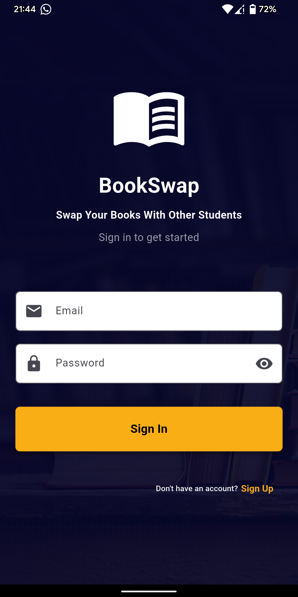
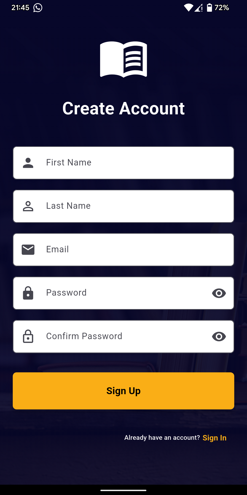
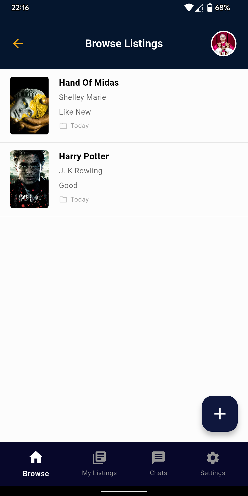
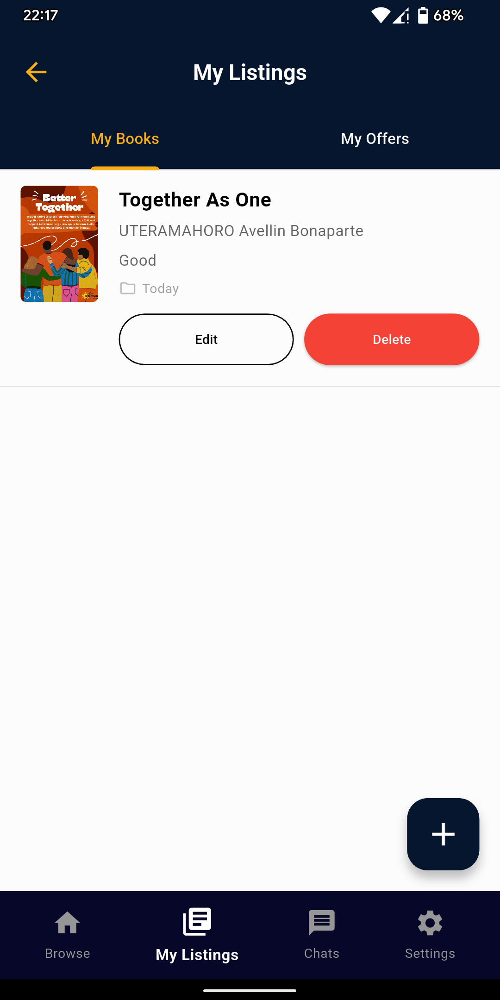
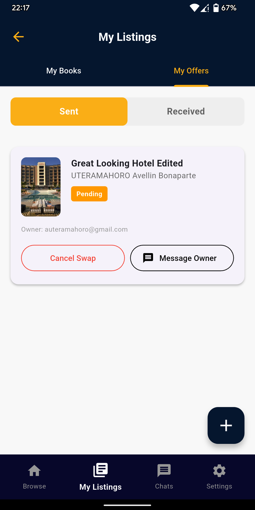
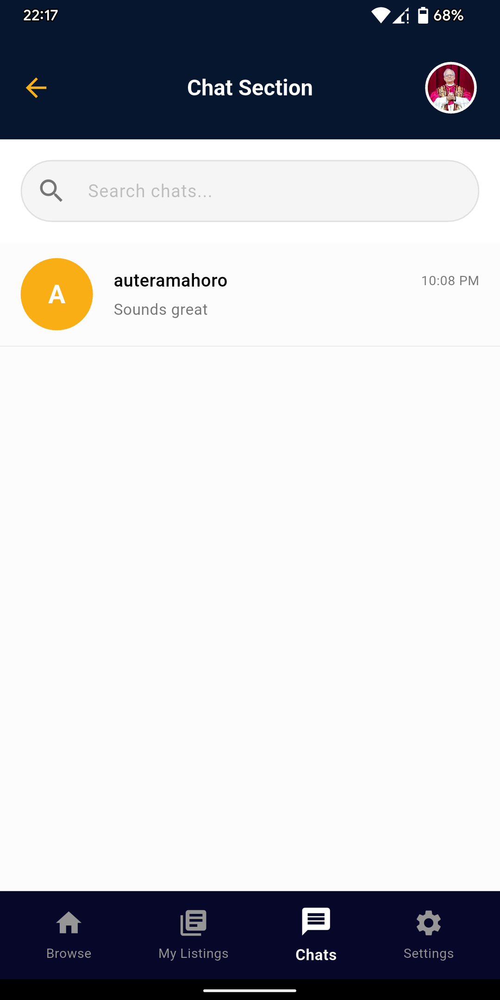
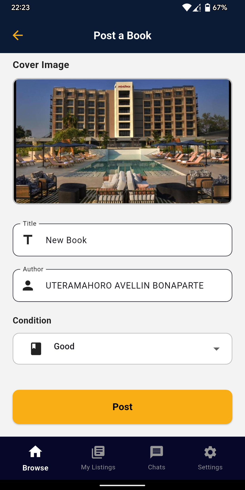
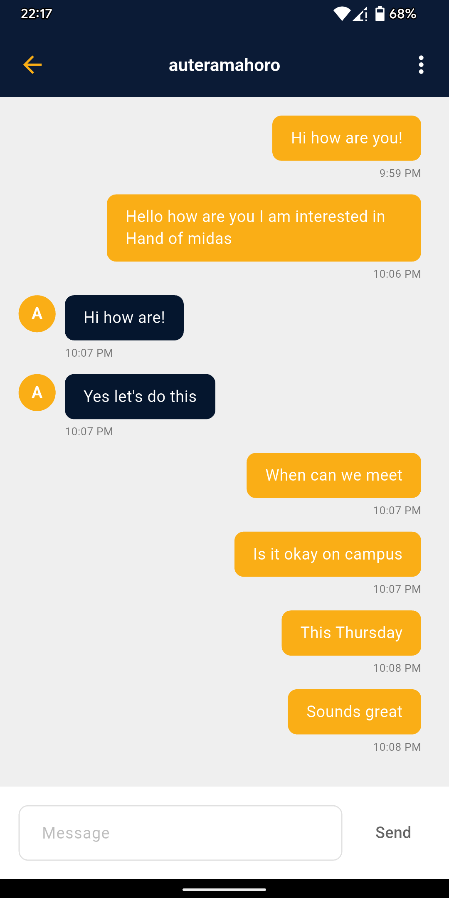
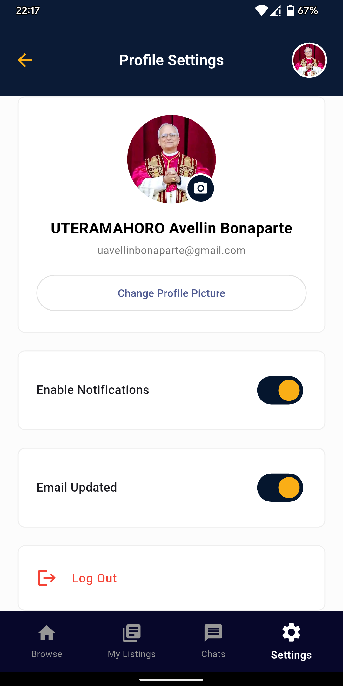

#  BookSwap

<div align="center">

**A modern Flutter application for swapping books between users**

[](https://flutter.dev/)
[](https://dart.dev/)
[](https://firebase.google.com/)
[](https://riverpod.dev/)

[Features](#-features) • [Screenshots](#-ui-screenshots) • [Architecture](#-architecture) • [Setup](#-setup) • [Documentation](#-documentation)

</div>

---

##  UI Screenshots

<div align="center">

### Main Screens

<table>
  <tr>
    <td align="center">
      
      <br />
      <b>Login</b>
    </td>
    <td align="center">
      
      <br />
      <b>Signup</b>
    </td>
    <td align="center">
      
      <br />
      <b>Browse Books</b>
    </td>
  </tr>
  <tr>
  <td align="center">
      
      <br />
      <b>My Listings - My books</b>
    </td>
  <td align="center">
      
      <br />
      <b>My Listings - My Offers</b>
    </td>
    <td align="center">
      
      <br />
      <b>Chat Section</b>
    </td>
  </tr>
  <tr align="center">
  <td align="center">
      
      <br />
      <b>Post Book</b>
    </td>
    <td align="center">
      
      <br />
      <b>Chat Body</b>
    </td>
    <td align="center">
      
      <br />
      <b>Settings / ProfileSection</b>
    </td>
  </tr>
</table>

</div>

---

##  Features

###  Authentication
- Email/password signup and login
- Email verification system
- Secure session management
- Profile management

### Book Management
- Create, read, update, and delete book listings
- Upload book cover images
- Book condition tracking (New, Like New, Good, Used)
- Browse all available books
- View your own listings

###  Swap Functionality
- Make swap offers to other users
- Accept/reject swap requests
- Real-time swap status updates
- Track swap history

###  Real-time Chat
- Instant messaging between users
- Chat initiated after swap requests
- Message notifications
- Chat history persistence

###  User Interface
- Modern, clean design
- Bottom navigation for easy access
- Responsive layouts
- Smooth animations

###  Settings & Profile
- Profile picture management
- Notification preferences
- Account settings
- Secure logout

---

##  Architecture

### Tech Stack

- **Frontend**: Flutter 3.9.2+
- **State Management**: Riverpod 2.6.1
- **Backend**: Firebase
  - **Authentication**: Firebase Auth
  - **Database**: Cloud Firestore
  - **Storage**: Firebase Storage
- **Notifications**: Local Notifications

## ERD Diagram


### State Management

This project uses **Riverpod** for state management, providing:

- **Providers**: Dependency injection and singleton services
- **StreamProviders**: Real-time Firestore data streams
- **FutureProviders**: Async operations
- **StateProviders**: Simple reactive state (e.g., selected tab index)
- **StateNotifierProviders**: Complex state with business logic

#### Key Patterns:

**1. Service Providers** - Singleton services
```dart
final bookServiceProvider = Provider<BookService>((ref) => BookService());
```

**2. Stream Providers** - Real-time data
```dart
final allBooksProvider = StreamProvider<List<Book>>((ref) {
  final bookService = ref.watch(bookServiceProvider);
  return bookService.getAllBooks();
});
```

**3. Family Providers** - Parameterized providers
```dart
final userBooksProvider = StreamProvider.family<List<Book>, String>((ref, userId) {
  final bookService = ref.watch(bookServiceProvider);
  return bookService.getBooksByUser(userId);
});
```

**4. Consumer Widgets** - Reactive UI
```dart
class MyWidget extends ConsumerWidget {
  Widget build(BuildContext context, WidgetRef ref) {
    final books = ref.watch(allBooksProvider);
    // UI updates automatically when data changes
  }
}
```

### Project Structure

```
lib/
├── Firebase/              # Firebase authentication and providers
│   ├── auth_providers.dart    # Riverpod providers for auth state
│   ├── auth_service.dart      # Authentication service
│   └── auth_wrapper.dart      # Auth state wrapper (routes based on auth)
│
├── Models/               # Data models
│   ├── book.dart             # Book listing model
│   ├── chat.dart             # Chat conversation model
│   ├── message.dart          # Message model
│   └── swap.dart             # Swap request model
│
├── Services/            # Business logic and data access
│   ├── book_providers.dart    # Riverpod providers for books
│   ├── book_service.dart       # Book CRUD operations
│   ├── chat_providers.dart     # Riverpod providers for chats
│   ├── chat_service.dart       # Chat operations
│   ├── notification_service.dart # Local notifications
│   ├── profile_providers.dart   # Riverpod providers for profiles
│   ├── profile_service.dart    # Profile operations
│   ├── swap_providers.dart     # Riverpod providers for swaps
│   └── swap_service.dart       # Swap operations
│
├── Screens/             # Full-screen UI components
│   ├── add_book.dart           # Add/Edit book screen
│   ├── chat_detail.dart        # Chat conversation screen
│   ├── email_verification.dart # Email verification screen
│   ├── home.dart               # Main home screen with navigation
│   ├── login.dart              # Login screen
│   ├── my_offers.dart          # My swap offers screen
│   └── signup.dart             # Signup screen
│
├── Layouts/             # Reusable layout components
│   ├── bottom-navigation.dart  # Bottom navigation bar
│   ├── browse-layout.dart       # Browse books layout
│   ├── chat-layout.dart         # Chat list layout
│   ├── listing-layout.dart      # My listings layout
│   ├── settings-layout.dart     # Settings layout
│   └── top-navigation.dart     # Top app bar
│
├── Widgets/             # Reusable widgets
│   └── notification_listener_widget.dart # Notification listener
│
└── routes/              # Navigation routing
    └── routes.dart          # Route definitions and generator
```

### Architecture Diagram

```
┌─────────────────────────────────────────────────────────────┐
│                        UI Layer                              │
│  (Screens, Layouts) - ConsumerWidgets consuming Providers   │
└──────────────────────┬──────────────────────────────────────┘
                       │ ref.watch() / ref.read()
                       ▼
┌─────────────────────────────────────────────────────────────┐
│                    State Management                          │
│  Riverpod Providers (StreamProvider, FutureProvider, etc.)  │
└──────────────────────┬──────────────────────────────────────┘
                       │
                       ▼
┌─────────────────────────────────────────────────────────────┐
│                    Service Layer                             │
│  (BookService, ChatService, SwapService, AuthService)       │
└──────────────────────┬──────────────────────────────────────┘
                       │
                       ▼
┌─────────────────────────────────────────────────────────────┐
│                    Firebase Backend                          │
│  ┌──────────────┐  ┌──────────────┐  ┌──────────────┐      │
│  │  Firestore   │  │  Firebase    │  │  Firebase    │      │
│  │  (Database)  │  │  Auth        │  │  Storage     │      │
│  └──────────────┘  └──────────────┘  └──────────────┘      │
└─────────────────────────────────────────────────────────────┘
```

**Firestore Collections:**
- `books`: Book listings with userId, title, author, condition, coverImageUrl
- `swaps`: Swap offers with requesterId, ownerId, bookId, status
- `chats`: Chat conversations with participants array
  - `messages`: Subcollection with chat messages

**Data Flow:**
1. User action in UI → `ref.read(serviceProvider).method()`
2. Service method → Firebase operation
3. Firebase updates → StreamProvider emits new data
4. UI rebuilds automatically via `ref.watch()`

---

##  Setup

### Prerequisites

- **Flutter SDK** 3.9.2 or higher
- **Dart SDK** (included with Flutter)
- **Firebase account** ([Get started](https://firebase.google.com/))
- **Android Studio** / **Xcode** (for mobile development)
- **Git**

### Firebase Configuration

#### 1. Create Firebase Project

1. Go to [Firebase Console](https://console.firebase.google.com/)
2. Click "Add project" or select existing project
3. Follow the setup wizard

#### 2. Enable Firebase Services

Enable the following services in Firebase Console:

**Authentication:**
- Go to Authentication → Sign-in method
- Enable "Email/Password" provider

**Firestore Database:**
- Go to Firestore Database → Create database
- Start in test mode (or use production with security rules)
- Choose a location (e.g., us-central1)

**Storage:**
- Go to Storage → Get started
- Start in test mode (or use production with security rules)

#### 3. Configure Android App

1. In Firebase Console: Project Settings → Add app → Android
2. Register app with package name: `com.example.bookswap` (or your package name)
3. Download `google-services.json`
4. Place it in `android/app/google-services.json`
5. Add to `android/app/build.gradle.kts`:
   ```kotlin
   plugins {
       id("com.android.application")
       id("kotlin-android")
       id("com.google.gms.google-services") // Add this
   }
   ```
6. Add to `android/build.gradle.kts`:
   ```kotlin
   dependencies {
       classpath("com.google.gms:google-services:4.4.0") // Add this
   }
   ```

#### 4. Configure iOS App

1. In Firebase Console: Project Settings → Add app → iOS
2. Register app with bundle ID: `com.example.bookswap` (or your bundle ID)
3. Download `GoogleService-Info.plist`
4. Place it in `ios/Runner/GoogleService-Info.plist`
5. Open `ios/Runner.xcworkspace` in Xcode
6. Ensure `GoogleService-Info.plist` is added to the Runner target

#### 5. Configure Security Rules

**Firestore Rules:**
- Go to Firestore Database → Rules
- Copy rules from `firestore.rules`
- Publish the rules

**Storage Rules:**
- Go to Storage → Rules
- Copy rules from `storage.rules`
- Publish the rules

#### 6. Create Firestore Indexes

Deploy required indexes:
```bash
firebase deploy --only firestore:indexes
```

Or manually create in Firebase Console:
- Collection: `swaps`
  - Fields: `ownerId` (Ascending), `status` (Ascending), `createdAt` (Descending)

### Installation

#### 1. Clone the Repository

```bash
git clone <repository-url>
cd bookswap
```

#### 2. Install Dependencies

```bash
flutter pub get
```

#### 3. Run the App

**Development:**
```bash
flutter run
```

**Specific Device:**
```bash
flutter devices  # List available devices
flutter run -d <device-id>
```

#### 4. Build for Production

**Android APK:**
```bash
flutter build apk --release
```

**Android App Bundle:**
```bash
flutter build appbundle --release
```

**iOS:**
```bash
flutter build ios --release
```

---

## 🛠️ Development

### Running Tests

```bash
flutter test
```

### Code Analysis

```bash
flutter analyze
```

### Formatting Code

```bash
flutter format .
```

### Hot Reload

Press `r` in the terminal while the app is running to hot reload changes.

---

##  Key Dependencies

| Package | Version | Purpose |
|---------|---------|---------|
| `flutter_riverpod` | ^2.6.1 | State management |
| `firebase_core` | ^3.6.0 | Firebase core |
| `firebase_auth` | ^5.3.1 | Authentication |
| `cloud_firestore` | ^5.4.3 | Database |
| `firebase_storage` | ^12.3.2 | File storage |
| `image_picker` | ^1.1.2 | Image selection |
| `shared_preferences` | ^2.2.2 | Local storage |
| `flutter_local_notifications` | ^17.2.2 | Local notifications |
| `http` | ^1.2.2 | HTTP requests |
| `path_provider` | ^2.1.4 | File system paths |

---

##  Troubleshooting

### Firebase Initialization Errors

**Problem:** Firebase initialization fails

**Solutions:**
1. Clean and rebuild:
   ```bash
   flutter clean
   flutter pub get
   flutter run
   ```

2. Check configuration files:
   - Ensure `google-services.json` is in `android/app/`
   - Ensure `GoogleService-Info.plist` is in `ios/Runner/`
   - Verify package name/bundle ID matches Firebase project

3. Verify Firebase Console:
   - All services are enabled
   - Security rules are published

### Common Issues

**"No Firebase App '[DEFAULT]' has been created"**
- Solution: Ensure Firebase is initialized in `main.dart` before `runApp()`

**"Permission denied" errors**
- Solution: Check Firestore and Storage security rules

**Image upload fails**
- Solution: Verify Storage is enabled and rules allow authenticated uploads

**Notifications not working**
- Solution: Check notification permissions and ensure NotificationService is initialized

---

##  Documentation

### Code Structure

The codebase is well-commented with:
- File-level documentation explaining purpose and usage
- Inline comments for complex logic
- Architecture explanations in key files

### Key Files

- **`lib/main.dart`**: App entry point, initialization
- **`lib/routes/routes.dart`**: Navigation system
- **`lib/Firebase/auth_wrapper.dart`**: Authentication flow
- **`lib/Screens/home.dart`**: Main app interface
- **`lib/Widgets/notification_listener_widget.dart`**: Notification handling
